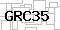
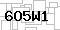

# Captcha Solver: Mini Project for Decoding Captchas

# Problem Statement
A website uses Captchas on a form to keep the web-bots away. The captchas it generates are quite similar each time and they follow the rules below:
- the number of characters remains the same each time
- the font and spacing is the same each time
- the background and foreground colors and texture, remain largely the same
- there is no skew in the structure of the characters.
- the captcha generator, creates strictly 5-character captchas, and each of the characters is either an
upper-case character (A-Z) or a numeral (0-9).

# Dataset
The dataset is a set of 25 captcha images with a resolution of 30 (H) x 60 (W) pixels in RGB-format. Below are three examples of the captchas
<p align="middle">
    
    
    
</p>

## Data Cleaning
Before performing inference, some data cleaning steps were performed. They are detailed as below:
1. There is a missing "output21.txt" file, containing the captcha text for "CL69V". A new "output21.txt" file was created for this
2. There is an additional "input100.jpg" file. If using a machine learning approach, this can be used as a test data point, while the other files in the "input" folder can be used as training data for a machine-learning based OCR. However, as we will detail below, we will not use a machine-learning based approach. As such, this file is moved out of the "input" folder so that the number of input files matches the number of output files. This facilitates evaluation.

## Exploratory Data Analysis
Each character from each captcha image was separated from the captcha and saved in the corresponding character folder under `sampleCaptchas/alphanums`.

By a process of trial and error, the 5 characters can be split using the pixel ranges as below. This can be found in the `explorer.ipynb` notebook.

`boundaries = [(4,14), (13,23), (22,32), (31,41), (40,50)]`

An example of the 'A' character is shown below.

<p align='middle'>
    
    
    
    
</p>

From the above, we can observe that although each character is exactly the same, their respective images differ in the background texture. Some preprocessing is required to remove the effect of backgrounds on the character image.

Additionally, since the captcha images are relatively small, the effectiveness of image recognition solutions may be limited due to the lack of spatial information in a small image size.

# Solution
## Optical Character Recognition (OCR)
A simple solution for this problem is to use OCR to recognise the characters on the captcha. Since each character in the captcha has similar font size, colour spacing and texture, this solution should suffice to give decent results as a prototype.

### Pytesseract OCR
The proposed solution below will use the `pytesseract` package which deploys the [tesseract](https://github.com/tesseract-ocr/tesseract) OCR to perform the character recognition. It is a well-documented and easy-to-use OCR engine. To install the package, use the command below.

```
pip install pytesseract
```

### Image Preprocessing
While OCR is the main tool for solving the captcha, its effectiveness depends largely on the quality of the images it sees during inference. In general, an image with little skew and as clear a text as possible is ideal for OCR to be effective. Due to the nature of the dataset as described above, we will explore the effect of adjusting the following image features.

1. Contrast and Background Removal: To remove any background artefacts from the image and retain only the characters in the captcha, so that the OCR only observes the character without noise.
2. Image rescaling and sharpening: To increase the number of pixels in the image and sharpening to improve clarity of the character after increasing resolution.

### Evaluation
To evaluate the effectiveness of the solution, the Hamming Distance metric is used. The Hamming Distance of two strings, $x$ and $y$ represents the number of positions in which the two strings differ. This is relevant to this use case to compare the difference between the OCR prediction and the ground truth.

$$H(x,y) = |x| + |y| - 2|x\cap y|$$

In the following evaluation table, we measure both the word-level error rate as well as the character-level error rate. The former gives us an indication of the OCR's overall performance, while the latter allows us to track if the OCR performs particularly well or poorly on certain characters.

### Evaluation Results
#### Rescaling + Sharpening
Below are the evaluation scores for a range of scales from 0.6 to 1.5 and the corresponding word-level (left plot) and character-level (right plot) errors. It can be observed that the OCR performs well at a scale of 1.0, 1.3 and 1.5.

<p align='middle'>
    
    
</p>

#### Contrast Adjustment
Varying the thresholds for contrast adjustment, the results are as below. From this plot, a threshold of 80 gives good OCR performance.

<p align='middle'>
    
    
</p>

### Combination
Combining the findings from above, some configurations for contrast and scale adjustments are evaluating to get a final score in the table below.

|Method|Word Level Error Rate|Character-Level Error Rate|
|:-:|:-:|:-:|
| Vanilla Tesseract | 64% | 35.2% |
| Increase contrast (threshold=80), sharpen and rescale (1.3x) | 52% | 20.8% |
| Increase contrast (threshold=80), sharpen and rescale (1.0x) | 56% | 18.4% |
| Increase contrast (threshold=80), sharpen and rescale (1.5x) | 72% | 31.2% |

## Further Work
The above solution presented is a simple prototypical solution for an OCR-based captcha solver. For further improvements, the following methods can be employed.

### Advanced OCR Techniques or Deep Learning Based OCR
We can train an object detector such as [YOLOX](https://github.com/Megvii-BaseDetection/YOLOX) to perform character recognition.

We can also test out other more advanced OCR software like [PaddlePaddleOCR](https://github.com/PaddlePaddle/PaddleOCR) which may give better results

### Grid Search to Find Most Optimal Combination of Preprocessing Steps
To get the best configuration for preprocessing steps, we can use grid search to find the best parameters.